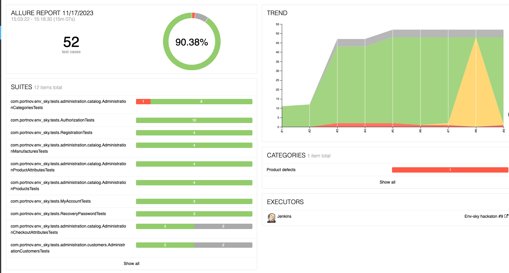

# Internet Store Automation Tests

This repository contains automation UI tests developed for the - [**Internet Store project**](https://env-sky.portnov.com/) used for participation in a hackathon.

## Overview

The automation tests in this repository are written in Java and utilize various technologies including:
- `Java`
- `Gradle`
- `Selenide`
- `JUnit`
- `RestAssured`
- `Allure Report`
- `Owner`
- `SQL Server: MSSQL-JDBC`

## Running the Tests

### Local Execution

To run the tests, use the following command:
```bash
gradle clean test
```

### Jenkins Execution
You can also trigger the tests via Jenkins by visiting this Jenkins job and clicking on `Build Now`. 

These tests will be executed on Selenoid. 

After the test run, notifications will be sent to Telegram.


### Jenkins


### Allure report
>**Main page**
&nbsp;


&nbsp;
>**Failed tests have Screenshot, Current url, Browser console logs**


&nbsp;
>**Tests are separated by features**


### Notifications
>**To Telegram**
